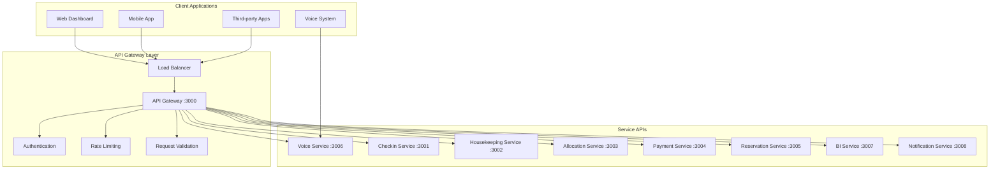

# API Handbook

Complete API documentation for the Hotel Management Platform, covering all microservices, authentication, error handling, and best practices.

## 📋 Table of Contents

1. [API Overview](#api-overview)
2. [Authentication & Security](#authentication--security)
3. [Core Services API](#core-services-api)
4. [Voice AI API](#voice-ai-api)
5. [Analytics & BI API](#analytics--bi-api)
6. [Error Handling](#error-handling)
7. [Rate Limiting](#rate-limiting)
8. [SDKs & Integration](#sdks--integration)

## 🌐 API Overview

The hotel management platform provides RESTful APIs and GraphQL endpoints for comprehensive hotel operations management. All APIs follow OpenAPI 3.0 specification and include comprehensive error handling, rate limiting, and monitoring.

### Base URLs

| Environment     | Base URL                                 | Description            |
| --------------- | ---------------------------------------- | ---------------------- |
| **Development** | `http://localhost:3000`                  | Local development      |
| **Staging**     | `https://api-staging.hotel-platform.com` | Staging environment    |
| **Production**  | `https://api.hotel-platform.com`         | Production environment |

### API Architecture



### Common Headers

```http
Content-Type: application/json
Accept: application/json
Authorization: Bearer {jwt_token}
X-Correlation-ID: {unique_request_id}
X-API-Version: v1
```

## 🔐 Authentication & Security

### JWT Authentication

All protected endpoints require JWT authentication. Obtain tokens via the login endpoint.

#### Login

```http
POST /api/auth/login
Content-Type: application/json

{
  "email": "admin@example.com",
  "password": "admin123"
}
```

**Response:**

```json
{
  "access_token": "eyJhbGciOiJIUzI1NiIsInR5cCI6IkpXVCJ9...",
  "token_type": "Bearer",
  "expires_in": 86400,
  "user": {
    "id": "user-123",
    "name": "Hotel Admin",
    "email": "admin@example.com",
    "role": "admin"
  }
}
```

#### Token Verification

```http
POST /api/auth/verify
Authorization: Bearer {token}
```

**Response:**

```json
{
  "valid": true,
  "user": {
    "id": "user-123",
    "name": "Hotel Admin",
    "email": "admin@example.com",
    "role": "admin"
  },
  "expires_at": "2024-01-16T10:00:00Z"
}
```

#### Register New User

```http
POST /api/auth/register
Content-Type: application/json

{
  "name": "New User",
  "email": "user@example.com",
  "password": "securePassword123",
  "role": "staff"
}
```

### Security Features

- **JWT Tokens**: Stateless authentication with configurable expiration
- **Role-based Access Control**: Admin, manager, staff, guest roles
- **Rate Limiting**: Multi-tier protection (3/sec, 20/10sec, 100/min)
- **Request Validation**: Comprehensive input validation
- **CORS Protection**: Configurable cross-origin policies

## 🏨 Core Services API

### 1. Checkin Service API

**Base Path**: `/api/v1/checkin`

#### Start Check-in Process

```http
POST /api/v1/checkin/scan
Authorization: Bearer {token}
Content-Type: application/json

{
  "qr_code": "QR_CODE_DATA",
  "device_id": "mobile-device-123"
}
```

**Response:**

```json
{
  "session_id": "checkin-session-456",
  "reservation": {
    "id": "res-789",
    "guest_name": "John Doe",
    "room_type": "Deluxe Suite",
    "check_in_date": "2024-01-15",
    "check_out_date": "2024-01-17"
  },
  "requires_otp": true,
  "message": "OTP sent to registered phone number"
}
```

#### Verify OTP

```http
POST /api/v1/checkin/verify-otp
Authorization: Bearer {token}
Content-Type: application/json

{
  "session_id": "checkin-session-456",
  "otp": "123456"
}
```

**Response:**

```json
{
  "status": "success",
  "room_assignment": {
    "room_number": "205",
    "floor": 2,
    "access_code": "7894"
  },
  "check_in_time": "2024-01-15T14:30:00Z",
  "welcome_message": "Welcome to Hotel Paradise! Your room is ready."
}
```

#### Get Check-in Status

```http
GET /api/v1/checkin/status/{session_id}
Authorization: Bearer {token}
```

### 2. Housekeeping Service API

**Base Path**: `/api/v1/housekeeping`

#### Get Room Status

```http
GET /api/v1/housekeeping/rooms
Authorization: Bearer {token}

# Query Parameters:
# - status: clean, dirty, maintenance, occupied
# - floor: 1, 2, 3, etc.
# - room_type: standard, deluxe, suite
```

**Response:**

```json
{
  "rooms": [
    {
      "id": "room-101",
      "room_number": "101",
      "status": "dirty",
      "room_type": "standard",
      "floor": 1,
      "last_cleaned": "2024-01-14T10:00:00Z",
      "estimated_cleaning_time": 45,
      "assigned_staff": {
        "id": "staff-123",
        "name": "Maria Santos"
      }
    }
  ],
  "summary": {
    "total_rooms": 50,
    "clean": 30,
    "dirty": 15,
    "maintenance": 3,
    "occupied": 2
  }
}
```

#### Create Housekeeping Task

```http
POST /api/v1/housekeeping/tasks
Authorization: Bearer {token}
Content-Type: application/json

{
  "room_id": "room-101",
  "task_type": "deep_cleaning",
  "priority": "high",
  "assigned_to": "staff-123",
  "scheduled_at": "2024-01-15T09:00:00Z",
  "notes": "Guest reported stained carpet"
}
```

**Response:**

```json
{
  "task_id": "task-456",
  "status": "scheduled",
  "estimated_duration": 60,
  "created_at": "2024-01-15T08:30:00Z"
}
```

#### Update Task Status

```http
PUT /api/v1/housekeeping/tasks/{task_id}
Authorization: Bearer {token}
Content-Type: application/json

{
  "status": "in_progress",
  "notes": "Started cleaning at 9:15 AM",
  "started_at": "2024-01-15T09:15:00Z"
}
```

### 3. Allocation Service API

**Base Path**: `/api/v1/allocation`

#### Check Room Availability

```http
GET /api/v1/allocation/availability
Authorization: Bearer {token}

# Query Parameters:
# - check_in: 2024-01-15
# - check_out: 2024-01-17
# - guests: 2
# - room_type: standard, deluxe, suite
```

**Response:**

```json
{
  "available_rooms": [
    {
      "room_id": "room-205",
      "room_number": "205",
      "room_type": "deluxe",
      "floor": 2,
      "capacity": 2,
      "amenities": ["wifi", "tv", "minibar", "balcony"],
      "base_rate": 120.0,
      "total_rate": 240.0,
      "currency": "USD"
    }
  ],
  "pricing": {
    "base_rate": 120.0,
    "taxes": 24.0,
    "service_charge": 12.0,
    "total": 276.0,
    "currency": "USD"
  },
  "policies": {
    "cancellation_policy": "Free cancellation until 24 hours before check-in",
    "deposit_required": 50.0
  }
}
```

#### Make Room Assignment

```http
POST /api/v1/allocation/assign
Authorization: Bearer {token}
Content-Type: application/json

{
  "reservation_id": "res-789",
  "room_id": "room-205",
  "guest_preferences": {
    "floor_preference": "high",
    "room_features": ["balcony", "city_view"]
  },
  "special_requests": "Late checkout if possible"
}
```

**Response:**

```json
{
  "assignment_id": "assign-123",
  "room_number": "205",
  "confirmation_code": "HC205A15",
  "assignment_date": "2024-01-15T10:30:00Z",
  "features_granted": ["balcony", "city_view"],
  "late_checkout_approved": true
}
```

### 4. Payment Service API

**Base Path**: `/api/v1/payments`

#### Initiate Payment

```http
POST /api/v1/payments/initiate
Authorization: Bearer {token}
Content-Type: application/json

{
  "reservation_id": "res-789",
  "amount": 276.00,
  "currency": "USD",
  "payment_method": "bkash",
  "customer": {
    "name": "John Doe",
    "email": "john@example.com",
    "phone": "+8801712345678"
  },
  "return_url": "https://hotel-platform.com/payment/return",
  "cancel_url": "https://hotel-platform.com/payment/cancel"
}
```

**Response:**

```json
{
  "payment_id": "pay-456",
  "status": "pending",
  "payment_url": "https://bkash.com/payment/abc123",
  "qr_code": "data:image/png;base64,iVBORw0KGgoAAAANSUhEUgAA...",
  "expires_at": "2024-01-15T11:00:00Z",
  "instructions": "Complete payment within 30 minutes"
}
```

#### Get Payment Status

```http
GET /api/v1/payments/{payment_id}
Authorization: Bearer {token}
```

**Response:**

```json
{
  "payment_id": "pay-456",
  "status": "completed",
  "amount": 276.0,
  "currency": "USD",
  "payment_method": "bkash",
  "transaction_id": "TXN789123",
  "completed_at": "2024-01-15T10:45:00Z",
  "receipt": {
    "receipt_number": "RCP-456789",
    "download_url": "https://api.hotel-platform.com/receipts/RCP-456789.pdf"
  }
}
```

#### Refund Payment

```http
POST /api/v1/payments/{payment_id}/refund
Authorization: Bearer {token}
Content-Type: application/json

{
  "amount": 100.00,
  "reason": "Partial cancellation",
  "notes": "Customer cancelled one night"
}
```

### 5. Reservation Service API

**Base Path**: `/api/v1/reservations`

#### Create Reservation

```http
POST /api/v1/reservations
Authorization: Bearer {token}
Content-Type: application/json

{
  "guest": {
    "name": "John Doe",
    "email": "john@example.com",
    "phone": "+1234567890",
    "identification": "passport-123456"
  },
  "stay": {
    "check_in": "2024-01-15",
    "check_out": "2024-01-17",
    "guests": 2,
    "room_type": "deluxe"
  },
  "preferences": {
    "floor_preference": "high",
    "special_requests": "Anniversary celebration"
  }
}
```

**Response:**

```json
{
  "reservation_id": "res-789",
  "confirmation_code": "HC789DEL",
  "status": "confirmed",
  "guest_id": "guest-123",
  "room_assignment": {
    "room_number": "205",
    "room_type": "deluxe"
  },
  "payment": {
    "total_amount": 276.0,
    "deposit_required": 50.0,
    "payment_due": "2024-01-15T18:00:00Z"
  },
  "created_at": "2024-01-15T10:30:00Z"
}
```

#### Get Reservation Details

```http
GET /api/v1/reservations/{reservation_id}
Authorization: Bearer {token}
```

**Response:**

```json
{
  "reservation_id": "res-789",
  "confirmation_code": "HC789DEL",
  "status": "confirmed",
  "guest": {
    "id": "guest-123",
    "name": "John Doe",
    "email": "john@example.com",
    "phone": "+1234567890"
  },
  "stay": {
    "check_in": "2024-01-15",
    "check_out": "2024-01-17",
    "nights": 2,
    "guests": 2
  },
  "room": {
    "room_number": "205",
    "room_type": "deluxe",
    "floor": 2,
    "amenities": ["wifi", "tv", "minibar", "balcony"]
  },
  "payment": {
    "total_amount": 276.0,
    "paid_amount": 276.0,
    "payment_status": "paid",
    "payment_date": "2024-01-15T10:45:00Z"
  },
  "timeline": [
    {
      "event": "reservation_created",
      "timestamp": "2024-01-15T10:30:00Z"
    },
    {
      "event": "payment_completed",
      "timestamp": "2024-01-15T10:45:00Z"
    }
  ]
}
```

#### Update Reservation

```http
PUT /api/v1/reservations/{reservation_id}
Authorization: Bearer {token}
Content-Type: application/json

{
  "stay": {
    "check_out": "2024-01-18"
  },
  "special_requests": "Late checkout requested"
}
```

#### Cancel Reservation

```http
DELETE /api/v1/reservations/{reservation_id}
Authorization: Bearer {token}
Content-Type: application/json

{
  "reason": "Change of plans",
  "refund_requested": true
}
```

### 6. Notification Service API

**Base Path**: `/api/v1/notifications`

#### Send Notification

```http
POST /api/v1/notifications/send
Authorization: Bearer {token}
Content-Type: application/json

{
  "recipient": "+8801712345678",
  "channel": "sms",
  "template": "booking_confirmation",
  "data": {
    "guest_name": "John Doe",
    "confirmation_code": "HC789DEL",
    "check_in_date": "January 15, 2024",
    "room_number": "205"
  },
  "priority": "high"
}
```

**Response:**

```json
{
  "notification_id": "notif-123",
  "status": "queued",
  "estimated_delivery": "2024-01-15T10:32:00Z",
  "cost": 0.05,
  "currency": "USD"
}
```

#### Get Notification Status

```http
GET /api/v1/notifications/{notification_id}
Authorization: Bearer {token}
```

**Response:**

```json
{
  "notification_id": "notif-123",
  "status": "delivered",
  "recipient": "+8801712345678",
  "channel": "sms",
  "sent_at": "2024-01-15T10:31:00Z",
  "delivered_at": "2024-01-15T10:31:30Z",
  "cost": 0.05,
  "currency": "USD"
}
```

## 🎙️ Voice AI API

**Base Path**: `/api/v1/voice`

### Twilio Voice Webhooks

#### Handle Incoming Call

```http
POST /api/v1/twilio/voice
Content-Type: application/x-www-form-urlencoded

CallSid=CA1234567890abcdef&
From=%2B1234567890&
To=%2B0987654321&
CallStatus=ringing&
Direction=inbound
```

**Response (TwiML):**

```xml
<?xml version="1.0" encoding="UTF-8"?>
<Response>
  <Say voice="alice">
    Thank you for calling Hotel Paradise. Please tell me how I can help you today.
  </Say>
  <Record
    timeout="5"
    maxLength="30"
    action="/api/v1/twilio/recording"
    method="POST"
  />
</Response>
```

#### Process Voice Recording

```http
POST /api/v1/twilio/recording
Content-Type: application/x-www-form-urlencoded

CallSid=CA1234567890abcdef&
RecordingUrl=https://api.twilio.com/recording.wav&
RecordingDuration=15
```

### Voice Processing API

#### Transcribe Audio

```http
POST /api/v1/voice/transcribe
Authorization: Bearer {token}
Content-Type: application/json

{
  "audio_url": "https://api.twilio.com/recording.wav",
  "call_sid": "CA1234567890abcdef",
  "language": "en-US"
}
```

**Response:**

```json
{
  "transcript": "I would like to make a reservation for two people for next Friday and Saturday",
  "confidence": 0.95,
  "language_detected": "en-US",
  "duration": 4.2,
  "processing_time": 1.1
}
```

#### Detect Intent

```http
POST /api/v1/voice/intent
Authorization: Bearer {token}
Content-Type: application/json

{
  "transcript": "I would like to make a reservation for two people for next Friday and Saturday",
  "call_sid": "CA1234567890abcdef",
  "caller_phone": "+1234567890"
}
```

**Response:**

```json
{
  "intent": "make_reservation",
  "confidence": 0.92,
  "parameters": {
    "guests": 2,
    "check_in_date": "2024-01-19",
    "check_out_date": "2024-01-21",
    "duration_nights": 2
  },
  "suggested_response": "I'd be happy to help you make a reservation for 2 guests from January 19th to 21st. Let me check our availability.",
  "next_action": "check_availability"
}
```

#### Generate TTS Response

```http
POST /api/v1/voice/tts
Authorization: Bearer {token}
Content-Type: application/json

{
  "text": "Great! I found available rooms for your dates. We have a deluxe suite available for $120 per night. Would you like me to proceed with the reservation?",
  "voice": "nova",
  "language": "en-US",
  "call_sid": "CA1234567890abcdef"
}
```

**Response:**

```json
{
  "audio_url": "https://api.hotel-platform.com/tts/audio-123.mp3",
  "duration": 8.5,
  "expires_at": "2024-01-15T11:00:00Z",
  "twiml_url": "https://api.hotel-platform.com/twiml/response-123"
}
```

### Voice Session Management

#### Get Voice Session

```http
GET /api/v1/voice/session/{call_sid}
Authorization: Bearer {token}
```

**Response:**

```json
{
  "call_sid": "CA1234567890abcdef",
  "session_id": "session-456",
  "status": "active",
  "caller_phone": "+1234567890",
  "start_time": "2024-01-15T10:30:00Z",
  "duration": 120,
  "guest_name": "John Doe",
  "is_returning_guest": true,
  "conversation_history": [
    {
      "timestamp": "2024-01-15T10:30:15Z",
      "type": "user_speech",
      "content": "I would like to make a reservation",
      "confidence": 0.95
    },
    {
      "timestamp": "2024-01-15T10:30:30Z",
      "type": "assistant_response",
      "content": "I'd be happy to help with your reservation",
      "intent": "make_reservation"
    }
  ],
  "current_intent": "make_reservation",
  "context": {
    "check_in_date": "2024-01-19",
    "check_out_date": "2024-01-21",
    "guests": 2
  }
}
```

## 📊 Analytics & BI API

**Base Path**: `/api/v1/analytics`

### Dashboard Data

#### Get Dashboard Summary

```http
GET /api/v1/analytics/dashboard
Authorization: Bearer {token}

# Query Parameters:
# - period: today, week, month, quarter, year
# - start_date: 2024-01-01
# - end_date: 2024-01-31
```

**Response:**

```json
{
  "period": "month",
  "summary": {
    "total_bookings": 245,
    "revenue": 89450.0,
    "occupancy_rate": 78.5,
    "adr": 125.5,
    "revpar": 98.43
  },
  "trends": {
    "bookings": {
      "current": 245,
      "previous": 220,
      "change_percent": 11.4
    },
    "revenue": {
      "current": 89450.0,
      "previous": 82300.0,
      "change_percent": 8.7
    }
  },
  "breakdown": {
    "by_room_type": [
      {
        "room_type": "deluxe",
        "bookings": 85,
        "revenue": 42500.0,
        "occupancy": 85.0
      }
    ],
    "by_source": [
      {
        "source": "direct",
        "bookings": 98,
        "revenue": 35820.0,
        "percentage": 40.0
      },
      {
        "source": "voice_ai",
        "bookings": 45,
        "revenue": 16750.0,
        "percentage": 18.4
      }
    ]
  }
}
```

### Voice Analytics

#### Get Voice Call Analytics

```http
GET /api/v1/analytics/voice
Authorization: Bearer {token}

# Query Parameters:
# - period: today, week, month
# - intent: make_reservation, check_availability, etc.
```

**Response:**

```json
{
  "summary": {
    "total_calls": 156,
    "successful_calls": 142,
    "success_rate": 91.0,
    "avg_call_duration": 180,
    "voice_to_booking_rate": 18.5
  },
  "intent_distribution": [
    {
      "intent": "make_reservation",
      "count": 45,
      "success_rate": 89.0,
      "avg_confidence": 0.92
    },
    {
      "intent": "check_availability",
      "count": 38,
      "success_rate": 95.0,
      "avg_confidence": 0.94
    }
  ],
  "performance_metrics": {
    "avg_response_time": 2.3,
    "transcript_accuracy": 94.5,
    "intent_accuracy": 91.8,
    "customer_satisfaction": 4.2
  },
  "trends": [
    {
      "date": "2024-01-15",
      "calls": 12,
      "bookings": 3,
      "conversion_rate": 25.0
    }
  ]
}
```

### Revenue Analytics

#### Get Revenue Metrics

```http
GET /api/v1/analytics/revenue
Authorization: Bearer {token}

# Query Parameters:
# - period: month, quarter, year
# - breakdown: daily, weekly, monthly
```

**Response:**

```json
{
  "period": "month",
  "metrics": {
    "total_revenue": 89450.0,
    "room_revenue": 76230.0,
    "service_revenue": 13220.0,
    "adr": 125.5,
    "revpar": 98.43,
    "occupancy_rate": 78.5
  },
  "forecasting": {
    "next_month_prediction": 95200.0,
    "confidence_interval": [88000.0, 102400.0],
    "growth_rate": 6.4
  },
  "breakdown": {
    "daily_revenue": [
      {
        "date": "2024-01-15",
        "revenue": 3450.0,
        "bookings": 28,
        "occupancy": 82.0
      }
    ]
  }
}
```

### Guest Analytics

#### Get Guest Metrics

```http
GET /api/v1/analytics/guests
Authorization: Bearer {token}
```

**Response:**

```json
{
  "summary": {
    "total_guests": 1245,
    "new_guests": 432,
    "returning_guests": 813,
    "retention_rate": 65.3,
    "avg_stay_duration": 2.8
  },
  "cohort_analysis": [
    {
      "cohort": "2024-01",
      "guests": 245,
      "month_1_retention": 23.5,
      "month_3_retention": 15.2,
      "ltv": 485.5
    }
  ],
  "satisfaction": {
    "avg_rating": 4.3,
    "nps_score": 67,
    "review_count": 189
  },
  "demographics": {
    "age_groups": [
      {
        "range": "25-34",
        "percentage": 32.5
      }
    ],
    "booking_sources": [
      {
        "source": "direct",
        "percentage": 45.2
      }
    ]
  }
}
```

## ❌ Error Handling

### Standard Error Response

```json
{
  "error": {
    "code": "VALIDATION_ERROR",
    "message": "Request validation failed",
    "details": [
      {
        "field": "check_in_date",
        "message": "Check-in date must be in the future"
      }
    ],
    "timestamp": "2024-01-15T10:30:00Z",
    "request_id": "req-123456"
  }
}
```

### HTTP Status Codes

| Status Code | Description           | Example Use Case                 |
| ----------- | --------------------- | -------------------------------- |
| **200**     | OK                    | Successful GET request           |
| **201**     | Created               | Resource created successfully    |
| **400**     | Bad Request           | Invalid request parameters       |
| **401**     | Unauthorized          | Missing or invalid JWT token     |
| **403**     | Forbidden             | Insufficient permissions         |
| **404**     | Not Found             | Resource not found               |
| **409**     | Conflict              | Room already booked              |
| **422**     | Unprocessable Entity  | Business logic validation failed |
| **429**     | Too Many Requests     | Rate limit exceeded              |
| **500**     | Internal Server Error | Server error                     |
| **503**     | Service Unavailable   | Service temporarily down         |

### Error Codes Reference

| Error Code                 | HTTP Status | Description                      |
| -------------------------- | ----------- | -------------------------------- |
| `VALIDATION_ERROR`         | 400         | Request validation failed        |
| `AUTHENTICATION_FAILED`    | 401         | Invalid credentials              |
| `TOKEN_EXPIRED`            | 401         | JWT token expired                |
| `INSUFFICIENT_PERMISSIONS` | 403         | User lacks required role         |
| `RESOURCE_NOT_FOUND`       | 404         | Requested resource doesn't exist |
| `ROOM_UNAVAILABLE`         | 409         | Room not available for booking   |
| `PAYMENT_FAILED`           | 422         | Payment processing failed        |
| `RATE_LIMIT_EXCEEDED`      | 429         | Too many requests                |
| `EXTERNAL_SERVICE_ERROR`   | 502         | Third-party service error        |
| `SERVICE_UNAVAILABLE`      | 503         | Service temporarily unavailable  |

### Error Handling Best Practices

```javascript
// Example error handling in client code
async function makeReservation(reservationData) {
  try {
    const response = await fetch('/api/v1/reservations', {
      method: 'POST',
      headers: {
        'Content-Type': 'application/json',
        Authorization: `Bearer ${token}`,
      },
      body: JSON.stringify(reservationData),
    });

    if (!response.ok) {
      const error = await response.json();

      switch (error.error.code) {
        case 'ROOM_UNAVAILABLE':
          alert(
            'Sorry, that room is no longer available. Please select another room.'
          );
          break;
        case 'PAYMENT_FAILED':
          alert(
            'Payment processing failed. Please try again or use a different payment method.'
          );
          break;
        case 'VALIDATION_ERROR':
          displayValidationErrors(error.error.details);
          break;
        default:
          alert('An unexpected error occurred. Please try again.');
      }

      throw new Error(error.error.message);
    }

    return await response.json();
  } catch (error) {
    console.error('Reservation failed:', error);
    throw error;
  }
}
```

## 🚦 Rate Limiting

The API implements multi-tier rate limiting to ensure fair usage and system stability.

### Rate Limit Tiers

| Tier       | Limit        | Window     | Description                 |
| ---------- | ------------ | ---------- | --------------------------- |
| **Short**  | 3 requests   | 1 second   | Burst protection            |
| **Medium** | 20 requests  | 10 seconds | Short-term abuse prevention |
| **Long**   | 100 requests | 1 minute   | Long-term usage control     |

### Rate Limit Headers

```http
X-RateLimit-Limit-Short: 3
X-RateLimit-Remaining-Short: 2
X-RateLimit-Reset-Short: 1642248600

X-RateLimit-Limit-Medium: 20
X-RateLimit-Remaining-Medium: 18
X-RateLimit-Reset-Medium: 1642248610

X-RateLimit-Limit-Long: 100
X-RateLimit-Remaining-Long: 95
X-RateLimit-Reset-Long: 1642248660
```

### Rate Limit Response

When rate limit is exceeded:

```http
HTTP/1.1 429 Too Many Requests
Content-Type: application/json
Retry-After: 1

{
  "error": {
    "code": "RATE_LIMIT_EXCEEDED",
    "message": "Rate limit exceeded. Please try again in 1 second.",
    "retry_after": 1,
    "limit": 3,
    "window": 1
  }
}
```

## 🛠️ SDKs & Integration

### JavaScript/TypeScript SDK

```bash
npm install @hotel-platform/api-sdk
```

```typescript
import { HotelPlatformAPI } from '@hotel-platform/api-sdk';

const client = new HotelPlatformAPI({
  baseUrl: 'https://api.hotel-platform.com',
  apiKey: 'your-api-key',
  timeout: 30000,
});

// Make a reservation
const reservation = await client.reservations.create({
  guest: {
    name: 'John Doe',
    email: 'john@example.com',
    phone: '+1234567890',
  },
  stay: {
    checkIn: '2024-01-15',
    checkOut: '2024-01-17',
    guests: 2,
    roomType: 'deluxe',
  },
});

// Check availability
const availability = await client.allocation.checkAvailability({
  checkIn: '2024-01-15',
  checkOut: '2024-01-17',
  guests: 2,
});
```

### Python SDK

```bash
pip install hotel-platform-sdk
```

```python
from hotel_platform import HotelPlatformAPI

client = HotelPlatformAPI(
    base_url='https://api.hotel-platform.com',
    api_key='your-api-key'
)

# Make a reservation
reservation = client.reservations.create({
    'guest': {
        'name': 'John Doe',
        'email': 'john@example.com',
        'phone': '+1234567890'
    },
    'stay': {
        'check_in': '2024-01-15',
        'check_out': '2024-01-17',
        'guests': 2,
        'room_type': 'deluxe'
    }
})
```

### REST API Client Examples

#### cURL

```bash
# Login
curl -X POST https://api.hotel-platform.com/api/auth/login \
  -H "Content-Type: application/json" \
  -d '{
    "email": "admin@example.com",
    "password": "admin123"
  }'

# Make reservation with token
curl -X POST https://api.hotel-platform.com/api/v1/reservations \
  -H "Content-Type: application/json" \
  -H "Authorization: Bearer YOUR_JWT_TOKEN" \
  -d '{
    "guest": {
      "name": "John Doe",
      "email": "john@example.com",
      "phone": "+1234567890"
    },
    "stay": {
      "check_in": "2024-01-15",
      "check_out": "2024-01-17",
      "guests": 2,
      "room_type": "deluxe"
    }
  }'
```

#### Postman Collection

Import the complete Postman collection for testing:

```bash
# Download collection
curl -O https://api.hotel-platform.com/docs/postman-collection.json

# Import in Postman and set environment variables:
# - base_url: https://api.hotel-platform.com
# - jwt_token: (obtained from login)
```

### GraphQL API

Access the GraphQL playground at `/graphql`:

```graphql
# Login mutation
mutation Login {
  login(loginInput: { email: "admin@example.com", password: "admin123" }) {
    access_token
    user {
      id
      name
      email
      role
    }
  }
}

# Query reservations
query GetReservations {
  reservations(
    filter: { status: CONFIRMED }
    pagination: { page: 1, limit: 10 }
  ) {
    items {
      id
      confirmationCode
      guest {
        name
        email
      }
      room {
        roomNumber
        roomType
      }
      stay {
        checkIn
        checkOut
        guests
      }
    }
    pagination {
      total
      pages
      current
    }
  }
}
```

### Webhooks

Register webhooks to receive real-time updates:

```http
POST /api/v1/webhooks
Authorization: Bearer {token}
Content-Type: application/json

{
  "url": "https://your-app.com/webhooks/hotel-platform",
  "events": [
    "reservation.created",
    "reservation.confirmed",
    "payment.completed",
    "checkin.completed"
  ],
  "secret": "your-webhook-secret"
}
```

Webhook payload example:

```json
{
  "event": "reservation.created",
  "timestamp": "2024-01-15T10:30:00Z",
  "data": {
    "reservation_id": "res-789",
    "confirmation_code": "HC789DEL",
    "guest_id": "guest-123",
    "amount": 276.0,
    "currency": "USD"
  },
  "signature": "sha256=abc123..."
}
```

---

## 📝 Summary

This API handbook provides comprehensive documentation for integrating with the hotel management platform. Key features include:

- **RESTful APIs**: Well-designed endpoints following REST principles
- **GraphQL Support**: Flexible query capabilities
- **Authentication**: JWT-based security with role-based access
- **Rate Limiting**: Multi-tier protection against abuse
- **Error Handling**: Comprehensive error responses with clear codes
- **SDKs**: Official SDKs for popular programming languages
- **Real-time Updates**: Webhook support for event notifications

### Getting Started

1. **Obtain API credentials** from the admin panel
2. **Authenticate** using the `/api/auth/login` endpoint
3. **Start making API calls** with the JWT token
4. **Handle errors** appropriately based on status codes
5. **Monitor rate limits** to avoid throttling

### Support & Resources

- **Interactive Documentation**: https://api.hotel-platform.com/docs
- **GraphQL Playground**: https://api.hotel-platform.com/graphql
- **Postman Collection**: Available for download
- **SDK Documentation**: Language-specific guides
- **Support**: Contact the development team for assistance

For questions or issues with the API, refer to the comprehensive documentation or contact our support team.
