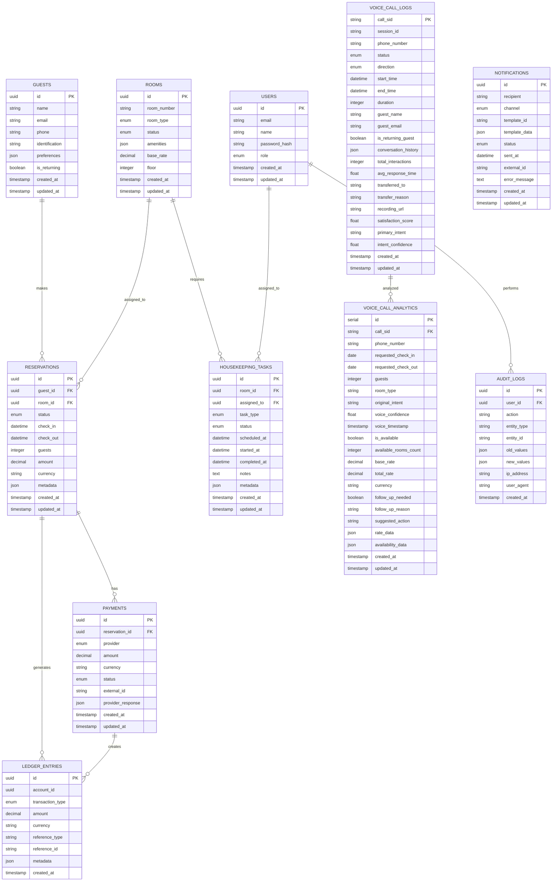
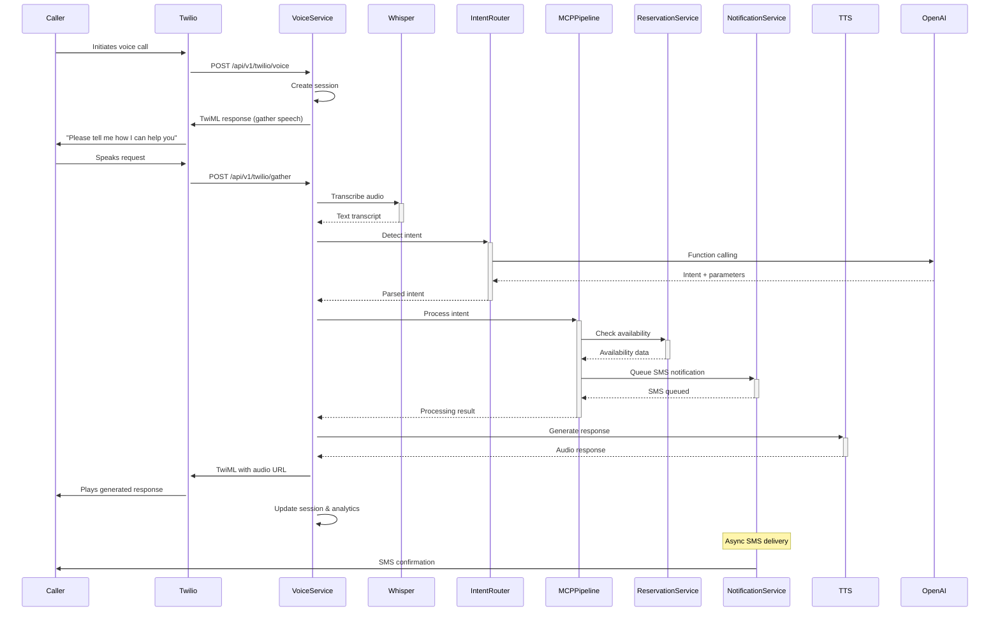
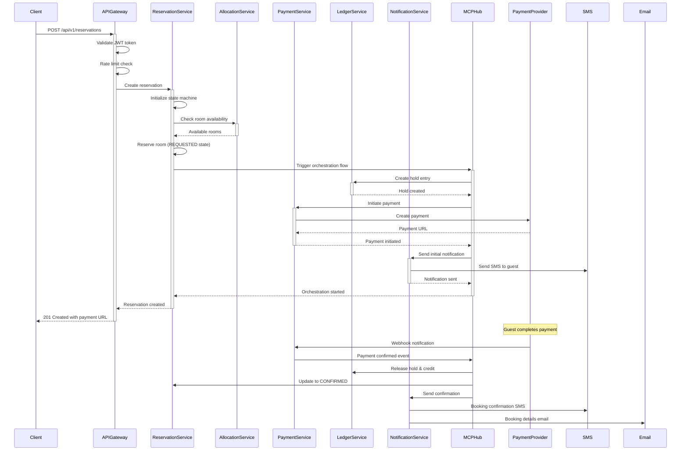
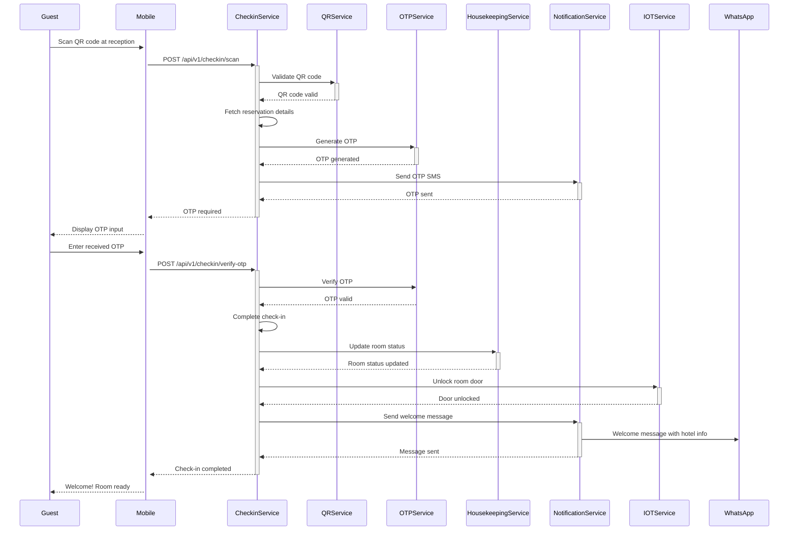
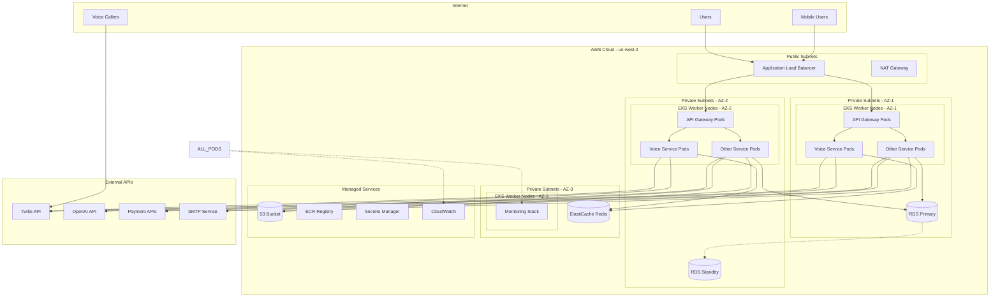
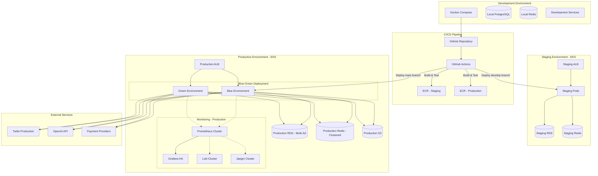
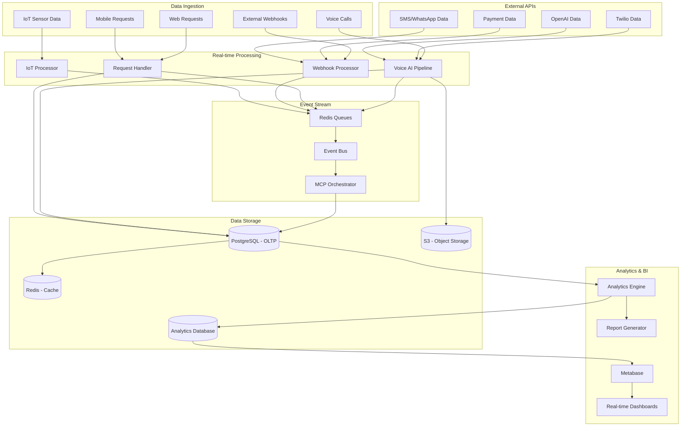

# System Architecture & Sequence Diagrams

This document provides comprehensive visual documentation of the hotel management platform architecture, including system diagrams, sequence flows, and interaction patterns.

## 📊 Table of Contents

1. [High-Level System Architecture](#high-level-system-architecture)
2. [Microservices Architecture](#microservices-architecture)
3. [Voice AI Pipeline](#voice-ai-pipeline)
4. [Database Schema](#database-schema)
5. [Sequence Diagrams](#sequence-diagrams)
6. [Network Architecture](#network-architecture)
7. [Deployment Architecture](#deployment-architecture)

## 🏗️ High-Level System Architecture

```mermaid
graph TB
    subgraph "Client Layer"
        WEB[Web Dashboards]
        MOBILE[Mobile Apps]
        VOICE[Voice Calls]
        API_CLIENTS[API Clients]
    end

    subgraph "Gateway Layer"
        LB[Load Balancer]
        AG[API Gateway]
        AUTH[Authentication]
        RATE[Rate Limiting]
    end

    subgraph "Application Layer"
        subgraph "Core Services"
            CHECKIN[Checkin Service]
            HOUSEKEEPING[Housekeeping Service]
            ALLOCATION[Allocation Service]
            PAYMENT[Payment Service]
            RESERVATION[Reservation Service]
            NOTIFICATION[Notification Service]
        end

        subgraph "AI Services"
            VOICE_SVC[Voice Service]
            WHISPER[Whisper STT]
            INTENT[Intent Router]
            TTS[Text-to-Speech]
        end

        subgraph "Analytics"
            BI[BI Service]
            ANALYTICS[Analytics Engine]
        end

        subgraph "Orchestration"
            MCP[MCP Hub]
            WORKFLOWS[n8n Workflows]
        end
    end

    subgraph "Data Layer"
        POSTGRES[(PostgreSQL)]
        REDIS[(Redis)]
        S3[(S3 Storage)]
        METABASE[(Metabase)]
    end

    subgraph "External Services"
        TWILIO[Twilio]
        OPENAI[OpenAI]
        PAYMENT_PROVIDERS[Payment Providers]
        SMTP[Email Service]
        WHATSAPP[WhatsApp API]
    end

    subgraph "Monitoring"
        PROMETHEUS[Prometheus]
        GRAFANA[Grafana]
        LOKI[Loki]
        JAEGER[Jaeger]
    end

    WEB --> LB
    MOBILE --> LB
    VOICE --> TWILIO
    API_CLIENTS --> LB

    LB --> AG
    AG --> AUTH
    AG --> RATE

    AG --> CHECKIN
    AG --> HOUSEKEEPING
    AG --> ALLOCATION
    AG --> PAYMENT
    AG --> RESERVATION
    AG --> NOTIFICATION
    AG --> VOICE_SVC
    AG --> BI

    VOICE_SVC --> WHISPER
    VOICE_SVC --> INTENT
    VOICE_SVC --> TTS
    WHISPER --> OPENAI
    INTENT --> OPENAI
    TTS --> OPENAI

    TWILIO --> VOICE_SVC

    MCP --> CHECKIN
    MCP --> HOUSEKEEPING
    MCP --> ALLOCATION
    MCP --> PAYMENT
    MCP --> RESERVATION
    MCP --> NOTIFICATION

    WORKFLOWS --> MCP

    CHECKIN --> POSTGRES
    HOUSEKEEPING --> POSTGRES
    ALLOCATION --> POSTGRES
    PAYMENT --> POSTGRES
    RESERVATION --> POSTGRES
    NOTIFICATION --> POSTGRES
    VOICE_SVC --> POSTGRES
    BI --> POSTGRES

    CHECKIN --> REDIS
    VOICE_SVC --> REDIS
    MCP --> REDIS

    BI --> METABASE
    VOICE_SVC --> S3

    PAYMENT --> PAYMENT_PROVIDERS
    NOTIFICATION --> SMTP
    NOTIFICATION --> WHATSAPP

    ALL_SERVICES -.-> PROMETHEUS
    PROMETHEUS --> GRAFANA
    ALL_SERVICES -.-> LOKI
    ALL_SERVICES -.-> JAEGER
```

## 🔧 Microservices Architecture

```mermaid
graph TB
    subgraph "API Gateway (Port 3000)"
        GW_REST[REST Endpoints]
        GW_GQL[GraphQL Endpoint]
        GW_AUTH[Authentication]
        GW_RATE[Rate Limiting]
        GW_VALIDATION[Request Validation]
    end

    subgraph "Voice Service (Port 3006)"
        V_WEBHOOK[Twilio Webhooks]
        V_STT[Speech-to-Text]
        V_INTENT[Intent Detection]
        V_TTS[Text-to-Speech]
        V_SESSION[Session Management]
    end

    subgraph "Checkin Service (Port 3001)"
        C_CHECKIN[Check-in/out Logic]
        C_QR[QR Code Generation]
        C_OTP[OTP Verification]
        C_IOT[IoT Integration]
    end

    subgraph "Housekeeping Service (Port 3002)"
        H_STATE[State Machine]
        H_TASKS[Task Management]
        H_WORKFLOW[Workflow Engine]
        H_MOBILE[Mobile API]
    end

    subgraph "Allocation Service (Port 3003)"
        A_ALGORITHM[Room Algorithm]
        A_AVAILABILITY[Availability Engine]
        A_PREFERENCES[Guest Preferences]
        A_OPTIMIZATION[Optimization]
    end

    subgraph "Payment Service (Port 3004)"
        P_BKASH[bKash Integration]
        P_NAGAD[Nagad Integration]
        P_SSL[SSLCommerz Integration]
        P_WEBHOOK[Webhook Handler]
        P_STATE[Payment States]
    end

    subgraph "Reservation Service (Port 3005)"
        R_STATE[Booking State Machine]
        R_LIFECYCLE[Booking Lifecycle]
        R_VALIDATION[Availability Validation]
        R_PRICING[Dynamic Pricing]
    end

    subgraph "BI Service (Port 3007)"
        B_ANALYTICS[Analytics Engine]
        B_REPORTS[Report Generation]
        B_KPI[KPI Calculation]
        B_DIGEST[Daily Digest]
        B_DASHBOARDS[Dashboard Data]
    end

    subgraph "Notification Service (Port 3008)"
        N_SMS[SMS Gateway]
        N_WHATSAPP[WhatsApp API]
        N_EMAIL[Email Service]
        N_TEMPLATES[Template Engine]
        N_QUEUE[Notification Queue]
    end

    GW_REST --> V_WEBHOOK
    GW_REST --> C_CHECKIN
    GW_REST --> H_STATE
    GW_REST --> A_ALGORITHM
    GW_REST --> P_BKASH
    GW_REST --> R_STATE
    GW_REST --> B_ANALYTICS
    GW_REST --> N_SMS

    V_INTENT --> R_STATE
    V_INTENT --> C_CHECKIN
    V_SESSION --> N_SMS

    C_CHECKIN --> A_ALGORITHM
    C_CHECKIN --> H_STATE
    C_CHECKIN --> N_SMS

    H_TASKS --> N_SMS

    R_LIFECYCLE --> P_BKASH
    R_LIFECYCLE --> N_SMS
    R_LIFECYCLE --> A_ALGORITHM

    P_STATE --> R_LIFECYCLE
    P_WEBHOOK --> R_STATE

    B_ANALYTICS --> N_EMAIL
```

## 🎙️ Voice AI Pipeline

```mermaid
graph LR
    subgraph "Voice Input Processing"
        CALL[Incoming Call] --> TWILIO_WEBHOOK[Twilio Webhook]
        TWILIO_WEBHOOK --> GATHER[Gather Speech]
        GATHER --> AUDIO_FILE[Audio Recording]
    end

    subgraph "Speech Processing"
        AUDIO_FILE --> WHISPER_API[OpenAI Whisper]
        WHISPER_API --> TRANSCRIPT[Text Transcript]
        TRANSCRIPT --> INTENT_ROUTER[Intent Router]
    end

    subgraph "Intent Processing"
        INTENT_ROUTER --> OPENAI_FUNCTIONS[OpenAI Functions]
        OPENAI_FUNCTIONS --> INTENT_RESULT[Intent + Parameters]
        INTENT_RESULT --> MCP_PIPELINE[MCP Pipeline]
    end

    subgraph "Business Logic"
        MCP_PIPELINE --> RESERVATION_SERVICE[Reservation Service]
        MCP_PIPELINE --> PAYMENT_SERVICE[Payment Service]
        MCP_PIPELINE --> ALLOCATION_SERVICE[Allocation Service]
        MCP_PIPELINE --> NOTIFICATION_SERVICE[Notification Service]
    end

    subgraph "Response Generation"
        RESERVATION_SERVICE --> RESPONSE_DATA[Service Response]
        PAYMENT_SERVICE --> RESPONSE_DATA
        ALLOCATION_SERVICE --> RESPONSE_DATA
        RESPONSE_DATA --> TTS_ENGINE[TTS Generation]
        TTS_ENGINE --> VOICE_RESPONSE[Voice Response]
        RESPONSE_DATA --> SMS_RESPONSE[SMS Response]
        RESPONSE_DATA --> WHATSAPP_RESPONSE[WhatsApp Response]
    end

    subgraph "Multi-channel Output"
        VOICE_RESPONSE --> TWILIO_CALL[Twilio Call Response]
        SMS_RESPONSE --> TWILIO_SMS[Twilio SMS]
        WHATSAPP_RESPONSE --> WHATSAPP_API[WhatsApp API]
    end

    TWILIO_CALL --> CALL_END[Call Completion]
    TWILIO_SMS --> NOTIFICATION_SENT[SMS Sent]
    WHATSAPP_API --> NOTIFICATION_SENT
```

## 💾 Database Schema

## 🔄 Sequence Diagrams

### Voice Call Processing Sequence

### Reservation Creation Sequence

### Check-in Process Sequence

## 🌐 Network Architecture

## 🚀 Deployment Architecture

## 📊 Data Flow Architecture

---

## 📝 Notes

### Architecture Principles

- **Microservices**: Loosely coupled, independently deployable services
- **Event-Driven**: Asynchronous communication via events and queues
- **Scalable**: Horizontal scaling with load balancing
- **Resilient**: Circuit breakers, retries, and graceful degradation
- **Observable**: Comprehensive monitoring and distributed tracing

### Design Patterns Used

- **API Gateway Pattern**: Centralized entry point
- **Saga Pattern**: Distributed transactions via MCP orchestration
- **CQRS**: Command Query Responsibility Segregation for analytics
- **Event Sourcing**: Audit logs and state reconstruction
- **Circuit Breaker**: Fault tolerance for external services

### Performance Considerations

- **Caching Strategy**: Redis for session data and frequently accessed data
- **Database Optimization**: Connection pooling, read replicas, query optimization
- **Async Processing**: Background jobs for heavy processing
- **CDN**: Static assets served via CloudFront
- **Load Balancing**: Application Load Balancer with health checks

These architectural diagrams provide a comprehensive view of the system design, data flow, and deployment strategy for the hotel management platform.
