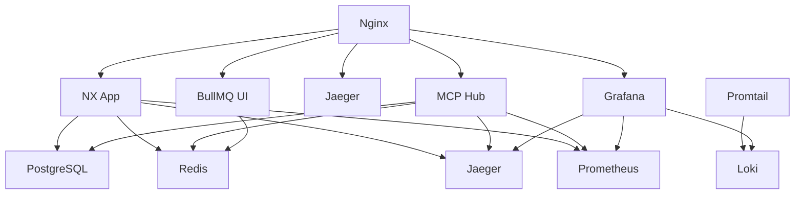

# NX Mono Repo Infrastructure

This document describes the infrastructure setup for the NX Mono Repo project, including both development (Docker Compose) and production (Kubernetes/Helm) environments.

## Overview

The infrastructure provides a comprehensive observability and service management stack including:

- **Databases**: PostgreSQL, Redis
- **Queue Management**: BullMQ with UI
- **Distributed Tracing**: Jaeger
- **Metrics**: Prometheus + Grafana
- **Logging**: Loki + Promtail
- **Orchestration**: MCP (Model Context Protocol) Hub
- **Reverse Proxy**: Nginx

## Development Environment (Docker Compose)

### Quick Start

```bash
# Start all services
docker-compose up -d

# View logs
docker-compose logs -f

# Stop services
docker-compose down
```

### Service URLs

| Service            | URL                    | Description                        |
| ------------------ | ---------------------- | ---------------------------------- |
| Main App           | http://localhost:3000  | NX Mono Repo Application           |
| Development Server | http://localhost:4200  | Development Build                  |
| Grafana            | http://localhost:3002  | Monitoring Dashboard (admin/admin) |
| Prometheus         | http://localhost:9090  | Metrics Collection                 |
| Jaeger             | http://localhost:16686 | Distributed Tracing                |
| BullMQ UI          | http://localhost:3001  | Queue Management                   |
| MCP Hub            | http://localhost:8080  | Orchestration API                  |
| Loki               | http://localhost:3100  | Log Aggregation                    |

### Service Architecture



### Configuration Files

- **Docker Compose**: `docker-compose.yml`
- **Prometheus**: `infrastructure/prometheus/prometheus.yml`
- **Grafana Datasources**: `infrastructure/grafana/datasources/`
- **Loki**: `infrastructure/loki/loki.yml`
- **Promtail**: `infrastructure/promtail/promtail.yml`
- **Nginx**: `infrastructure/nginx/nginx.conf`
- **MCP Hub**: `infrastructure/mcp-hub/server.js`

## Production Environment (Kubernetes/Helm)

### Prerequisites

- Kubernetes cluster (1.20+)
- Helm 3.0+
- kubectl configured

### Installation

```bash
# Add required Helm repositories
helm repo add bitnami https://charts.bitnami.com/bitnami
helm repo add prometheus-community https://prometheus-community.github.io/helm-charts
helm repo add grafana https://grafana.github.io/helm-charts
helm repo update

# Install dependencies
helm dependency update helm/nx-mono-infrastructure/

# Install the infrastructure
helm install nx-infra helm/nx-mono-infrastructure/ \
  --namespace infrastructure \
  --create-namespace \
  --values helm/nx-mono-infrastructure/values.yaml
```

### Configuration

The Helm chart includes the following components:

#### External Dependencies (Bitnami/Community Charts)

- **PostgreSQL**: Persistent database with metrics
- **Redis**: In-memory cache and queue backend
- **Prometheus**: Metrics collection and alerting
- **Grafana**: Monitoring dashboards and visualization
- **Loki**: Log aggregation
- **Promtail**: Log collection agent

#### Custom Services

- **MCP Orchestration Hub**: Task orchestration and workflow management
- **BullMQ UI**: Queue monitoring interface
- **Jaeger**: Distributed tracing (all-in-one deployment)

### Customization

Edit `helm/nx-mono-infrastructure/values.yaml` to customize:

```yaml
# Enable/disable services
postgresql:
  enabled: true
redis:
  enabled: true
prometheus:
  enabled: true
grafana:
  enabled: true
loki:
  enabled: true
jaeger:
  enabled: true
mcpHub:
  enabled: true
bullmqUI:
  enabled: true

# Resource limits
mcpHub:
  resources:
    limits:
      cpu: 500m
      memory: 512Mi
    requests:
      cpu: 250m
      memory: 256Mi
```

### Monitoring and Observability

#### Metrics (Prometheus + Grafana)

- **Application Metrics**: Custom metrics from NX app and MCP Hub
- **Infrastructure Metrics**: Node, pod, and service metrics
- **Database Metrics**: PostgreSQL and Redis performance
- **Queue Metrics**: BullMQ job processing statistics

#### Logging (Loki + Promtail)

- **Application Logs**: Structured logging from all services
- **Container Logs**: Kubernetes pod logs
- **Infrastructure Logs**: System and service logs

#### Tracing (Jaeger)

- **Distributed Tracing**: Request flow across services
- **Performance Analysis**: Latency and bottleneck identification
- **Error Tracking**: Exception and error tracing

### Security

#### Pod Security

- Non-root user execution
- Read-only root filesystem
- Dropped capabilities
- Security contexts applied

#### Network Security

- Network policies (optional)
- Service-to-service encryption (TLS)
- RBAC configuration

### Scaling

#### Horizontal Scaling

```bash
# Scale MCP Hub
kubectl scale deployment nx-infra-mcp-hub --replicas=3

# Scale application
kubectl scale deployment nx-infra-app --replicas=5
```

#### Vertical Scaling

Update resource requests/limits in values.yaml:

```yaml
mcpHub:
  resources:
    limits:
      cpu: 1000m
      memory: 1Gi
    requests:
      cpu: 500m
      memory: 512Mi
```

### Backup and Recovery

#### Database Backup

```bash
# PostgreSQL backup
kubectl exec -it nx-infra-postgresql-0 -- pg_dump -U postgres nx_mono_repo > backup.sql

# Redis backup
kubectl exec -it nx-infra-redis-master-0 -- redis-cli --rdb backup.rdb
```

#### Metrics Backup

Prometheus data is stored in persistent volumes and backed up according to your storage class backup policies.

### Troubleshooting

#### Common Issues

1. **Services not starting**: Check resource limits and node capacity
2. **Connectivity issues**: Verify network policies and service configurations
3. **Performance issues**: Review metrics in Grafana dashboards
4. **Log analysis**: Use Loki queries in Grafana to investigate issues

#### Debug Commands

```bash
# Check pod status
kubectl get pods -n infrastructure

# View pod logs
kubectl logs -f deployment/nx-infra-mcp-hub -n infrastructure

# Describe resources
kubectl describe deployment nx-infra-mcp-hub -n infrastructure

# Port forward for local access
kubectl port-forward svc/nx-infra-grafana 3000:3000 -n infrastructure
```

## MCP Orchestration Hub

The MCP (Model Context Protocol) Orchestration Hub is a custom service that manages task orchestration and workflow execution.

### Features

- **Task Queuing**: BullMQ integration for reliable task processing
- **Health Checks**: Comprehensive health monitoring
- **Metrics**: Prometheus metrics export
- **Logging**: Structured logging with Loki integration
- **Tracing**: Jaeger distributed tracing
- **API**: RESTful API for task management

### API Endpoints

| Method | Endpoint       | Description        |
| ------ | -------------- | ------------------ |
| POST   | `/orchestrate` | Queue a new task   |
| GET    | `/tasks/{id}`  | Get task status    |
| GET    | `/health`      | Health check       |
| GET    | `/metrics`     | Prometheus metrics |

### Usage Example

```bash
# Queue a task
curl -X POST http://localhost:8080/orchestrate \
  -H "Content-Type: application/json" \
  -d '{
    "taskType": "process_data",
    "payload": {"data": "example"},
    "priority": "high"
  }'

# Check task status
curl http://localhost:8080/tasks/1
```

## Maintenance

### Updates

```bash
# Update Docker images
docker-compose pull && docker-compose up -d

# Update Helm chart
helm upgrade nx-infra helm/nx-mono-infrastructure/ \
  --namespace infrastructure \
  --values helm/nx-mono-infrastructure/values.yaml
```

### Monitoring

Regular monitoring tasks:

1. Check Grafana dashboards for anomalies
2. Review Jaeger traces for performance issues
3. Monitor Loki logs for errors
4. Verify BullMQ queue health
5. Check PostgreSQL and Redis performance

### Cleanup

```bash
# Docker Compose cleanup
docker-compose down -v
docker system prune -f

# Kubernetes cleanup
helm uninstall nx-infra -n infrastructure
kubectl delete namespace infrastructure
```

## Support

For issues and questions:

1. Check this documentation
2. Review service logs
3. Check Grafana monitoring dashboards
4. Submit issues to the project repository

## Contributing

To contribute to the infrastructure:

1. Test changes locally with Docker Compose
2. Update Helm templates and values
3. Update this documentation
4. Submit pull requests with thorough testing
