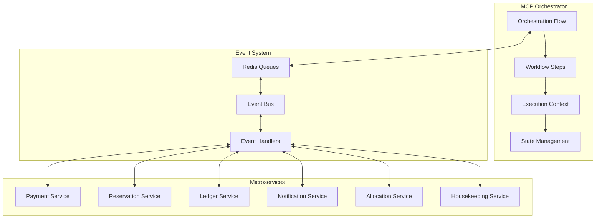
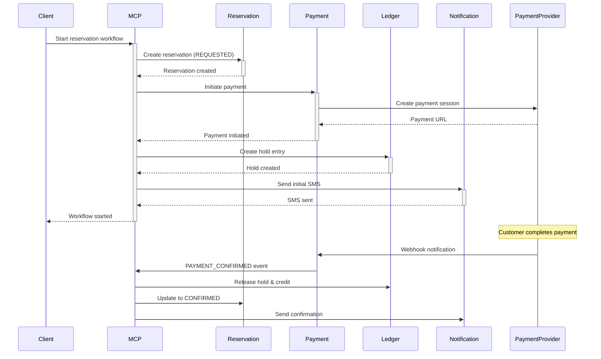
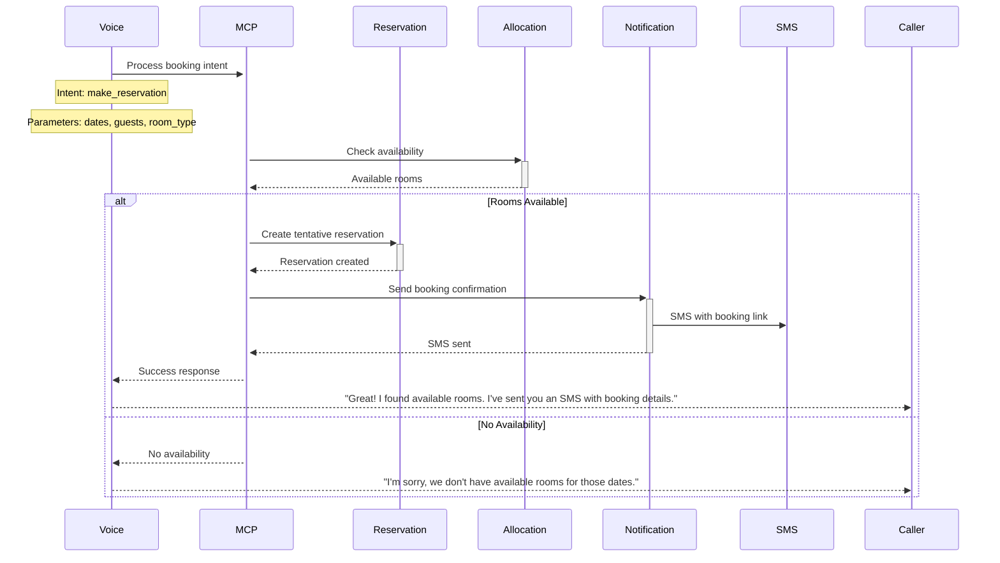
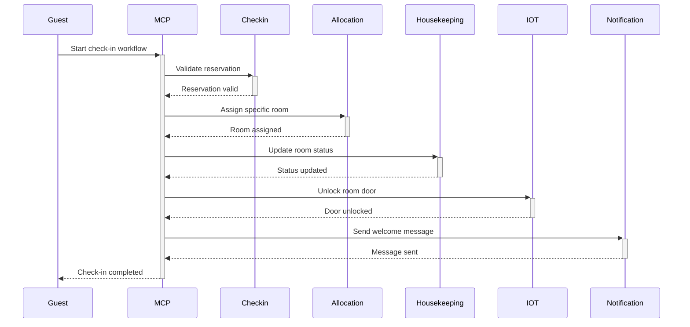
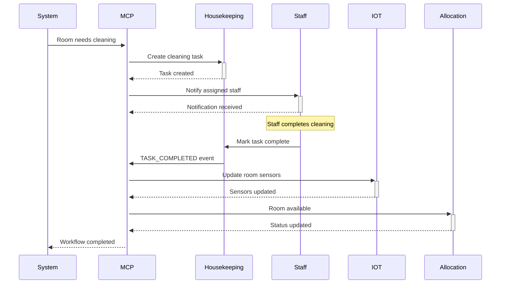

# MCP (Model Context Protocol) Workflow Guide

This comprehensive guide covers the MCP orchestration system that coordinates complex business workflows across multiple microservices in the hotel management platform.

## 📋 Table of Contents

1. [MCP Overview](#mcp-overview)
2. [Architecture & Components](#architecture--components)
3. [Workflow Types](#workflow-types)
4. [Implementation Details](#implementation-details)
5. [API Reference](#api-reference)
6. [Monitoring & Debugging](#monitoring--debugging)
7. [Best Practices](#best-practices)

## 🔄 MCP Overview

The Model Context Protocol (MCP) orchestrator is a central workflow engine that coordinates complex business processes across multiple microservices. It implements the Saga pattern for distributed transactions and provides reliable, observable, and scalable workflow execution.

### Key Features

- **Saga Pattern Implementation**: Distributed transaction management
- **Event-Driven Architecture**: Asynchronous communication via Redis queues
- **Fault Tolerance**: Retry mechanisms and compensation actions
- **Observability**: Comprehensive logging and distributed tracing
- **Scalability**: Horizontal scaling with multiple orchestrator instances

### Core Concepts



## 🏗️ Architecture & Components

### MCP Hub Service

**Location**: `infrastructure/mcp-hub/server.js`
**Port**: 8080

The MCP Hub is a Node.js service that provides:

- REST API for orchestration management
- Bull/Redis queue processing
- Health checks and metrics
- Distributed tracing integration

### MCP Orchestrator Class

**Location**: `libs/shared/utils/mcpOrchestrator.ts`

The core orchestration engine that manages:

- Workflow definition and execution
- Step coordination and state management
- Event handling and compensation
- Service communication

### Key Components

```typescript
interface OrchestrationFlow {
  id: string;
  context: OrchestrationContext;
  steps: OrchestrationStep[];
  currentStep: number;
  status: 'PENDING' | 'RUNNING' | 'COMPLETED' | 'FAILED';
  startTime: Date;
  endTime?: Date;
}

interface OrchestrationStep {
  id: string;
  service: string;
  action: string;
  input: any;
  output?: any;
  status: 'PENDING' | 'RUNNING' | 'COMPLETED' | 'FAILED';
  error?: string;
  retryCount?: number;
  compensationAction?: string;
}

interface OrchestrationContext {
  correlationId: string;
  userId?: string;
  sessionId?: string;
  metadata: Record<string, any>;
}
```

## 🔄 Workflow Types

### 1. Payment & Reservation Workflow

**Trigger**: New reservation request
**Duration**: ~2-30 minutes (including payment completion)
**Services**: Reservation → Payment → Ledger → Notification



### 2. Voice-to-Booking Workflow

**Trigger**: Voice intent detection
**Duration**: ~30 seconds - 5 minutes
**Services**: Voice → Reservation → Allocation → Notification



### 3. Check-in Workflow

**Trigger**: QR code scan or voice check-in request
**Duration**: ~1-2 minutes
**Services**: Checkin → Allocation → Housekeeping → IOT → Notification



### 4. Housekeeping Task Workflow

**Trigger**: Room status change or scheduled maintenance
**Duration**: ~15 minutes - 2 hours
**Services**: Housekeeping → Notification → IOT → Allocation



## 🛠️ Implementation Details

### Orchestrator Initialization

```typescript
// Initialize MCP orchestrator
const orchestrator = new MCPOrchestrator(eventQueue, {
  paymentService: 'http://payment-service:3004',
  reservationService: 'http://reservation-service:3005',
  ledgerService: 'http://ledger-service:3003',
  notificationService: 'http://notification-service:3008',
});
```

### Starting a Workflow

```typescript
// Start payment & reservation workflow
const context: OrchestrationContext = {
  correlationId: generateId(),
  userId: 'user-123',
  sessionId: 'session-456',
  metadata: { source: 'voice_call', callSid: 'CA123' },
};

const request = {
  customerId: 'guest-789',
  serviceId: 'room-suite-001',
  amount: 15000,
  currency: 'BDT',
  paymentProvider: 'BKASH',
  customerPhone: '+8801712345678',
  customerEmail: 'guest@example.com',
  startTime: new Date('2024-02-01'),
  endTime: new Date('2024-02-03'),
};

const flow = await orchestrator.orchestratePaymentReservationFlow(
  context,
  request
);
console.log('Workflow started:', flow.id);
```

### Event Handling

```typescript
// Handle payment confirmation event
const paymentEvent: PaymentEvent = {
  type: EventType.PAYMENT_CONFIRMED,
  data: {
    paymentId: 'pay-123',
    amount: 15000,
    currency: 'BDT',
    provider: 'BKASH',
    timestamp: new Date(),
  },
  metadata: {
    correlationId: 'flow-456',
  },
};

await orchestrator.handlePaymentEvent(paymentEvent);
```

### Service Communication

```typescript
// Call service with retry logic
private async callService(service: string, action: string, input: any): Promise<any> {
  const serviceUrl = this.services[service as keyof typeof this.services];
  const endpoint = this.getServiceEndpoint(service, action);

  const response = await axios.post(`${serviceUrl}${endpoint}`, input, {
    timeout: 30000,
    headers: {
      'Content-Type': 'application/json',
      'X-Correlation-ID': input.correlationId
    }
  });

  return response.data;
}
```

### Error Handling & Compensation

```typescript
// Handle step failure with compensation
private async handleStepFailure(flow: OrchestrationFlow, step: OrchestrationStep): Promise<void> {
  this.logger.error('Step failed, initiating compensation', {
    flowId: flow.id,
    stepId: step.id,
    error: step.error
  });

  // Execute compensation actions for completed steps
  for (let i = flow.currentStep - 1; i >= 0; i--) {
    const completedStep = flow.steps[i];
    if (completedStep.status === 'COMPLETED' && completedStep.compensationAction) {
      await this.executeCompensation(completedStep);
    }
  }

  flow.status = 'FAILED';
  flow.endTime = new Date();
}

private async executeCompensation(step: OrchestrationStep): Promise<void> {
  try {
    await this.callService(step.service, step.compensationAction!, {
      originalStepId: step.id,
      originalInput: step.input,
      originalOutput: step.output
    });

    this.logger.info('Compensation executed successfully', {
      stepId: step.id,
      compensationAction: step.compensationAction
    });
  } catch (error) {
    this.logger.error('Compensation failed', {
      stepId: step.id,
      error: error.message
    });
  }
}
```

## 📡 API Reference

### MCP Hub REST API

Base URL: `http://localhost:8080`

#### Start Orchestration

```http
POST /orchestrate
Content-Type: application/json

{
  "taskType": "payment_reservation_flow",
  "payload": {
    "customerId": "guest-123",
    "serviceId": "room-001",
    "amount": 10000,
    "currency": "BDT",
    "paymentProvider": "BKASH",
    "customerPhone": "+8801712345678",
    "startTime": "2024-02-01T00:00:00Z",
    "endTime": "2024-02-03T00:00:00Z"
  },
  "priority": "normal"
}
```

**Response:**

```json
{
  "taskId": "12345",
  "status": "queued",
  "taskType": "payment_reservation_flow",
  "priority": "normal",
  "timestamp": "2024-01-15T10:00:00Z"
}
```

#### Get Task Status

```http
GET /tasks/{taskId}
```

**Response:**

```json
{
  "taskId": "12345",
  "status": "completed",
  "data": {
    "taskType": "payment_reservation_flow",
    "payload": {...},
    "priority": "normal"
  },
  "progress": 100,
  "created": "2024-01-15T10:00:00Z",
  "processed": "2024-01-15T10:00:05Z",
  "finished": "2024-01-15T10:02:30Z",
  "result": {
    "status": "completed",
    "flowId": "flow-789",
    "reservationId": "res-456",
    "paymentId": "pay-123"
  },
  "error": null
}
```

#### Health Check

```http
GET /health
```

**Response:**

```json
{
  "status": "healthy",
  "timestamp": "2024-01-15T10:00:00Z",
  "services": {
    "redis": "connected",
    "postgres": "connected",
    "queues": "operational"
  }
}
```

#### Metrics

```http
GET /metrics
```

**Response:** Prometheus metrics format

### MCP Orchestrator API

#### Create Flow

```typescript
interface CreateFlowRequest {
  workflowType:
    | 'payment_reservation'
    | 'voice_booking'
    | 'checkin'
    | 'housekeeping';
  context: OrchestrationContext;
  payload: any;
}

const flow = await orchestrator.createFlow(request);
```

#### Get Flow Status

```typescript
const flow = orchestrator.getFlow(flowId);
const activeFlows = orchestrator.getActiveFlows();
const allFlows = orchestrator.getAllFlows();
```

#### Handle Events

```typescript
// Payment events
await orchestrator.handlePaymentEvent(paymentEvent);

// Reservation events
await orchestrator.handleReservationEvent(reservationEvent);

// Generic event handling
await orchestrator.handleEvent(eventType, eventData);
```

## 📊 Monitoring & Debugging

### Logging

MCP generates structured logs for all operations:

```json
{
  "timestamp": "2024-01-15T10:00:00Z",
  "level": "info",
  "service": "mcp-orchestrator",
  "message": "Orchestration flow started",
  "flowId": "flow-123",
  "correlationId": "corr-456",
  "workflowType": "payment_reservation",
  "metadata": {
    "userId": "user-789",
    "source": "voice_call"
  }
}
```

### Metrics

Key metrics exposed via Prometheus:

- `orchestration_tasks_total{status, type}`: Total orchestration tasks
- `orchestration_flow_duration_seconds{workflow_type}`: Flow execution time
- `orchestration_step_duration_seconds{service, action}`: Step execution time
- `orchestration_retry_total{service, action}`: Retry attempts
- `orchestration_compensation_total{service}`: Compensation executions

### Distributed Tracing

Each flow creates distributed traces with:

- Flow ID as trace ID
- Each step as a span
- Service calls as child spans
- Event handling as spans

### Health Monitoring

```bash
# Check MCP Hub health
curl http://localhost:8080/health

# Monitor queue status
curl http://localhost:8080/queues

# View metrics
curl http://localhost:8080/metrics
```

### Debugging Commands

```typescript
// Enable debug logging
process.env.LOG_LEVEL = 'debug';

// View active flows
const activeFlows = orchestrator.getActiveFlows();
console.log('Active flows:', activeFlows.length);

// Inspect specific flow
const flow = orchestrator.getFlow('flow-123');
console.log('Current step:', flow.steps[flow.currentStep]);

// Manual step execution (debugging)
await orchestrator.executeStep(flow, flow.steps[0]);
```

## 🎯 Best Practices

### 1. Workflow Design

- **Keep steps atomic**: Each step should be a single, reversible operation
- **Design for idempotency**: Steps should be safely retryable
- **Plan compensations**: Every step should have a compensation action
- **Use timeouts**: Set appropriate timeouts for each step
- **Minimize state**: Keep workflow state minimal and serializable

### 2. Error Handling

```typescript
// Good: Comprehensive error handling
try {
  const result = await this.callService(service, action, input);
  return result;
} catch (error) {
  if (error.code === 'TIMEOUT') {
    // Retry timeout errors
    throw new RetryableError(error.message);
  } else if (error.status >= 500) {
    // Retry server errors
    throw new RetryableError(error.message);
  } else {
    // Don't retry client errors
    throw new FatalError(error.message);
  }
}
```

### 3. Service Communication

```typescript
// Good: Include correlation context
const response = await axios.post(serviceUrl, payload, {
  headers: {
    'X-Correlation-ID': context.correlationId,
    'X-User-ID': context.userId,
    'X-Session-ID': context.sessionId,
  },
  timeout: 30000,
});
```

### 4. Event Handling

```typescript
// Good: Event validation and error handling
async handlePaymentEvent(event: PaymentEvent): Promise<void> {
  // Validate event
  if (!event.data.paymentId) {
    throw new ValidationError('Payment ID is required');
  }

  // Find relevant flows
  const flows = this.findFlowsByPaymentId(event.data.paymentId);

  if (flows.length === 0) {
    this.logger.warn('No flows found for payment event', {
      paymentId: event.data.paymentId
    });
    return;
  }

  // Process each flow
  for (const flow of flows) {
    try {
      await this.processPaymentEvent(flow, event);
    } catch (error) {
      this.logger.error('Failed to process payment event', {
        flowId: flow.id,
        paymentId: event.data.paymentId,
        error: error.message
      });
    }
  }
}
```

### 5. Testing Strategies

```typescript
// Unit testing workflow logic
describe('MCPOrchestrator', () => {
  it('should complete payment reservation flow', async () => {
    // Mock service calls
    const mockServices = {
      reservationService: jest
        .fn()
        .mockResolvedValue({ reservationId: 'res-123' }),
      paymentService: jest.fn().mockResolvedValue({ paymentId: 'pay-456' }),
      ledgerService: jest.fn().mockResolvedValue({ entryId: 'entry-789' }),
      notificationService: jest
        .fn()
        .mockResolvedValue({ messageId: 'msg-012' }),
    };

    const orchestrator = new MCPOrchestrator(eventQueue, mockServices);

    const flow = await orchestrator.orchestratePaymentReservationFlow(
      context,
      request
    );

    expect(flow.status).toBe('COMPLETED');
    expect(mockServices.reservationService).toHaveBeenCalled();
    expect(mockServices.paymentService).toHaveBeenCalled();
  });
});

// Integration testing with real services
describe('MCP Integration', () => {
  it('should handle payment webhook events', async () => {
    // Start workflow
    const flow = await orchestrator.orchestratePaymentReservationFlow(
      context,
      request
    );

    // Simulate payment completion
    const paymentEvent = createPaymentConfirmedEvent(flow.paymentId);
    await orchestrator.handlePaymentEvent(paymentEvent);

    // Verify flow completion
    const updatedFlow = orchestrator.getFlow(flow.id);
    expect(updatedFlow.status).toBe('COMPLETED');
  });
});
```

### 6. Performance Optimization

- **Parallel execution**: Execute independent steps in parallel
- **Caching**: Cache frequently accessed data (room availability, pricing)
- **Connection pooling**: Reuse HTTP connections to services
- **Queue batching**: Process multiple events in batches
- **Resource limits**: Set appropriate CPU/memory limits

### 7. Monitoring & Alerting

```typescript
// Add custom metrics
const flowDuration = new Histogram({
  name: 'orchestration_flow_duration_seconds',
  help: 'Time taken to complete orchestration flows',
  labelNames: ['workflow_type', 'status'],
});

// Instrument flows
const timer = flowDuration.startTimer({ workflow_type: 'payment_reservation' });
try {
  await executeFlow(flow);
  timer({ status: 'success' });
} catch (error) {
  timer({ status: 'failure' });
  throw error;
}
```

---

## 📝 Summary

The MCP orchestration system provides reliable, observable, and scalable workflow execution for complex business processes. By following the saga pattern and event-driven architecture, it ensures data consistency across distributed services while providing comprehensive monitoring and error handling capabilities.

Key benefits:

- **Reliability**: Fault-tolerant execution with compensation actions
- **Observability**: Comprehensive logging, metrics, and tracing
- **Scalability**: Horizontal scaling with queue-based processing
- **Maintainability**: Clear separation of concerns and testable components
- **Flexibility**: Easy to add new workflows and modify existing ones

For questions or support with MCP workflows, refer to the monitoring dashboards or contact the development team.
